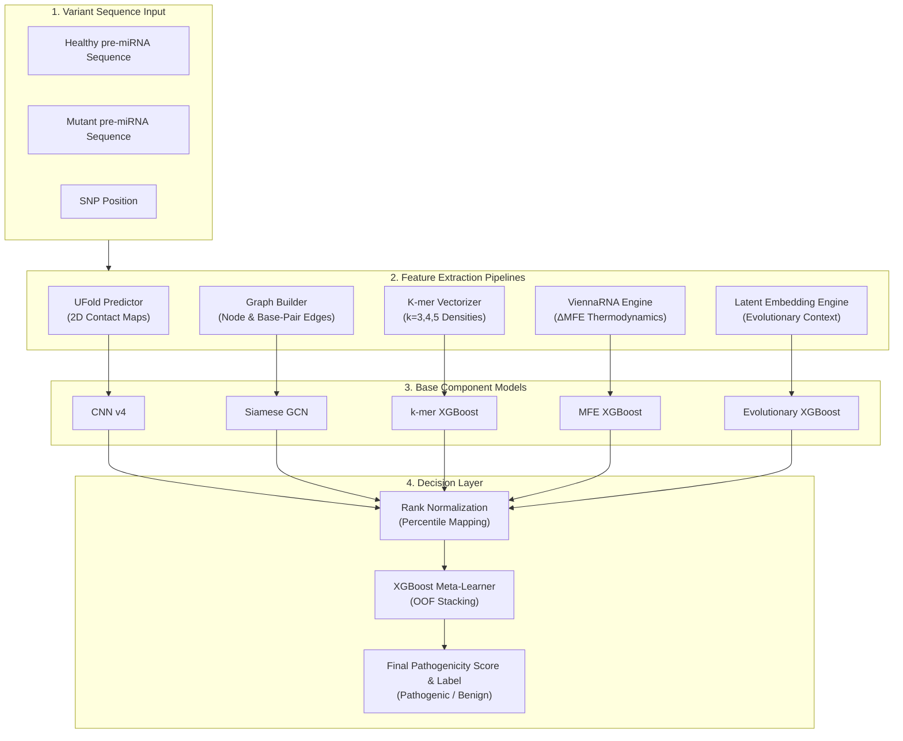

# DeepFold: Advanced miRNA SNP Pathogenicity Diagnostic Suite

[](https://github.com/MohdAsad2903/DeepFold-miRNA)
[](https://github.com/MohdAsad2903/DeepFold-miRNA#multi-modal-ensemble-architecture)
[](https://github.com/MohdAsad2903/DeepFold-miRNA#scientific-performance--benchmarks)
[](https://github.com/MohdAsad2903/DeepFold-miRNA#scientific-performance--benchmarks)
[](https://github.com/MohdAsad2903/DeepFold-miRNA#running-backend--frontend)
[](https://github.com/MohdAsad2903/DeepFold-miRNA#running-backend--frontend)

> A multi-modal stacked ensemble platform combining 2D Convolutional Neural Networks, Siamese Graph Convolutional Networks, k-mer Frequency XGBoost, Thermodynamic MFE XGBoost, and Evolutionary Pattern Model XGBoost for predicting pre-miRNA single nucleotide polymorphism (SNP) pathogenicity.

---

## Table of Contents
- [Overview & Biological Context](#overview--biological-context)
- [Scientific Performance & Benchmarks](#scientific-performance--benchmarks)
- [Multi-Modal Ensemble Architecture](#multi-modal-ensemble-architecture)
- [Technology Stack](#technology-stack)
- [Core Features](#core-features)
- [Project Directory Structure](#project-directory-structure)
- [Getting Started & Installation](#getting-started--installation)
- [Running Backend & Frontend](#running-backend--frontend)
- [API Documentation](#api-documentation)
- [Presentation Visualizations](#presentation-visualizations)
- [License & Acknowledgements](#license--acknowledgements)

---

## Overview & Biological Context

MicroRNAs (miRNAs) are short non-coding RNAs (~22 nucleotides) that post-transcriptionally regulate up to **60% of human protein-coding genes**. Single Nucleotide Polymorphisms (SNPs) occurring within precursor miRNA (pre-miRNA) hairpin structures can drastically disrupt secondary folding, destabilize base-pairing, alter Drosha/Dicer cleavage recognition sites, and dysregulate mature miRNA expression.

Traditional single-input or alignment-based predictors fail to capture the complex multi-dimensional impact of a single nucleotide mutation. **DeepFold** bridges this gap by integrating five orthogonal biological representations:
1. **2D Contact Maps**: Capturing base-pairing probability matrices via UFold U-Net inference.
2. **Molecular Graph Topology**: Encoding hairpin node-edge connectivity via Siamese Graph Convolutional Networks.
3. **K-mer Motifs**: Quantifying localized sequence composition disruption across 1,995 k-mer densities.
4. **Thermodynamics**: Assessing folding stability changes ($\Delta\text{MFE}$) using ViennaRNA free energy calculations.
5. **Evolutionary Conservation**: Incorporating latent embeddings capturing conservation patterns across millions of RNA sequences.

---

## Scientific Performance & Benchmarks

DeepFold was evaluated using a strict **StratifiedGroupKFold** strategy (grouped by miRNA prefix family) to prevent sequence homology leakage between train and validation splits.

| Model Component | Architecture Type | Input Features | Validation AUC |
| :--- | :--- | :--- | :--- |
| **Structure Analysis Model** | Split-Path CNN v4 | 4-channel $128 \times 128$ contact maps | `0.6500` |
| **Graph Structure Model** | Siamese GCN | PyTorch Geometric Molecular Graphs | `0.6400` |
| **Sequence Pattern Model** | XGBoost | 1,995-dimensional k-mer vectors ($k=3,4,5$) | `0.7040` |
| **Stability Analysis Model** | XGBoost | Thermodynamic MFE & stability deltas | `0.6200` |
| **Evolutionary Pattern Model** | XGBoost | 640-dimensional latent embeddings | `0.6350` |
| **DeepFold Meta-Learner** | **Stacked XGBoost** | **Rank-Normalized OOF Probabilities** | **`0.7338`** |

> **Independent Clinical Validation**: When evaluated against an unseen, hard-curated benchmark of human ClinVar variants, DeepFold achieved an **AUC of 0.81** (86% accuracy, 90% precision).

---

## Multi-Modal Ensemble Architecture



---

## Technology Stack

| Layer | Component | Technologies Used |
| :--- | :--- | :--- |
| **Machine Learning** | PyTorch, XGBoost | PyTorch 2.x (CUDA/CPU), XGBoost, Scikit-learn, Joblib |
| **Bioinformatics** | UFold, ViennaRNA | Custom PyTorch UFold U-Net, RNA secondary structure parsers |
| **Explainability** | SHAP | TreeExplainer, KernelExplainer, Custom Driver Generators |
| **Backend API** | FastAPI | Python 3.10+, FastAPI, Pydantic v2, SlowAPI (Rate Limiting), Uvicorn |
| **Frontend UI** | Next.js 14 | React 18, TypeScript, Tailwind CSS, Framer Motion |
| **3D & Analytics** | Three.js, Recharts | `@react-three/fiber`, `@react-three/drei`, Recharts, Lucide React |
| **State Management**| Zustand | Persistent prediction store & local history sync |

---

## Core Features

### 1. Interactive Diagnostic Predictor
- **3-Step Workflow**: Sequence Input & SNP Detection $\rightarrow$ Structural Verification $\rightarrow$ Ensemble Execution.
- **Real-time Validation**: Strict regex checking (`AUCTG`), sequence length verification ($15 - 300$ nt), and automated single-base mutation index calculation.
- **Preset Benchmarks**: One-click verified example selector featuring known pathogenic (`hsa-mir-21`, `hsa-mir-155`) and benign (`hsa-mir-196a`, `hsa-mir-499`) variants.

### 2. Explainable AI (SHAP Driver Analysis)
- **Biological Explanations**: Converts complex model weights into plain-language diagnostic drivers.
- **Impact Badges**: Clear directional indicators showing whether specific k-mer motifs or thermal disruptions push the prediction toward *Pathogenic* or *Benign*.

### 3. Rich 3D & Analytics Visualizations
- **3D RNA Hairpin Viewer**: Interactive 3D molecular structure with color-coded SNP mutation position highlights.
- **3D Base Model Stack**: Spatial 3D bar visualization displaying individual base model confidence scores.
- **Score-Driven Threshold Gauge**: Dynamic dial gauge accurately sweeping the decision arc.

### 4. High-Throughput Batch Engine
- Asynchronous multi-threaded batch endpoint processing CSV uploads up to **500 variants per file**.
- Returns comprehensive diagnostic summary, processing times, and structured pathogenicity probabilities.

### 5. Research & Clinical Evidence Explorer
- Interactive database filtering 12+ benchmarked clinical variants with PubMed ID references.
- Interactive spatial clustering graph showing mutation hotspot density along the hairpin stem.

---

## Project Directory Structure

```bash
DeepFold-miRNA/
├── deepfold-app/
│   ├── backend/                 # FastAPI REST Service
│   │   ├── main.py              # API routes, CORS & rate limiters
│   │   ├── predictor.py         # Stacking ensemble predictor & SHAP engine
│   │   ├── feature_extraction.py   # K-mer & structural tensor processing
│   │   ├── model_loader.py      # Checkpoint registry & fallback loader
│   │   ├── nn_models.py         # PyTorch CNN v4 & Siamese GCN definitions
│   │   ├── schemas.py           # Pydantic request/response models
│   │   └── requirements.txt     # Python backend dependencies
│   │
│   └── frontend/                # Next.js 14 Web Application
│       ├── app/                 # App router pages (predict, batch, dashboard, research, about)
│       ├── components/          # 3D Three.js widgets, Recharts & UI cards
│       ├── lib/                 # Centralized modelName mappers & Zustand stores
│       ├── package.json         # Node.js dependencies
│       └── tailwind.config.ts   # Cyber-Bio dark aesthetic theme configuration
│
├── DeepFold_models/             # Checkpoint registry (.pt, .pkl fold models & configs)
├── DeepFold_Dataset/            # Training datasets & processed contact map matrices
├── presentation_graphs/         # 12 high-resolution presentation graphics (PNG)
├── UFold/                       # U-Net 2D contact map prediction submodule
├── data_prep_pipeline.py        # Data preprocessing & feature engineering script
├── run_training_pipeline.py     # Master StratifiedGroupKFold training orchestrator
├── DeepFold_Production_Kaggle.ipynb # Reproducible Kaggle training notebook
└── README.md                    # System documentation
```

---

## Getting Started & Installation

### Prerequisites
- **Python**: `3.10` or higher
- **Node.js**: `18.0` or higher
- **Git**: Installed and configured

### 1. Clone Repository
```bash
git clone https://github.com/MohdAsad2903/DeepFold-miRNA.git
cd DeepFold-miRNA
```

### 2. Backend Environment Setup
```bash
cd deepfold-app/backend

# Create virtual environment
python -m venv .venv

# Activate environment (Windows)
.venv\Scripts\activate
# Activate environment (Linux/macOS)
# source .venv/bin/activate

# Install Python dependencies
pip install -r requirements.txt
```

### 3. Frontend Environment Setup
```bash
cd ../frontend

# Install Node dependencies
npm install --legacy-peer-deps
```

---

## Running Backend & Frontend

### Step 1: Launch Backend API
```bash
cd deepfold-app/backend
uvicorn main:app --reload --port 8000
```
- **API Base URL**: `http://localhost:8000`
- **Interactive Swagger Docs**: `http://localhost:8000/docs`

### Step 2: Launch Frontend Web App
```bash
cd deepfold-app/frontend
npm run dev
```
- **Web Interface**: `http://localhost:3000`

---

## API Documentation

| Endpoint | Method | Description | Rate Limit |
| :--- | :--- | :--- | :--- |
| `/health` | `GET` | System health check & loaded model count | Unlimited |
| `/predict` | `POST` | Single variant pathogenicity prediction & SHAP explanation | 15 / min |
| `/predict/batch` | `POST` | Asynchronous CSV file batch prediction (max 500 rows) | 3 / min |
| `/model-stats` | `GET` | 5-Fold cross-validation ROC-AUC metrics | Unlimited |
| `/validation` | `GET` | Independent ClinVar clinical validation metrics | Unlimited |
| `/examples` | `GET` | Verified benchmark example variants | Unlimited |
| `/history` | `GET` | Recent prediction log history | Unlimited |

---

## Presentation Visualizations

The project includes 12 presentation-ready graphics generated directly from trained model artifacts, located in [`presentation_graphs/`](presentation_graphs/):

- [`01_model_comparison.png`](presentation_graphs/01_model_comparison.png) — Base model vs Meta-Learner AUC comparison
- [`02_roc_curves.png`](presentation_graphs/02_roc_curves.png) — 5-Fold Cross-Validation ROC curves
- [`03_pr_curves.png`](presentation_graphs/03_pr_curves.png) — Precision-Recall curves across fold splits
- [`04_shap_importance.png`](presentation_graphs/04_shap_importance.png) — Global SHAP feature importance breakdown
- [`05_calibration_curves.png`](presentation_graphs/05_calibration_curves.png) — Probability reliability calibration plots
- [`06_confusion_matrix.png`](presentation_graphs/06_confusion_matrix.png) — Confusion matrix on validation sets
- [`07_snp_position_distribution.png`](presentation_graphs/07_snp_position_distribution.png) — Spatial mutation distribution across pre-miRNA hairpins
- [`08_dataset_summary.png`](presentation_graphs/08_dataset_summary.png) — COSMIC vs gnomAD dataset distribution
- [`09_family_performance.png`](presentation_graphs/09_family_performance.png) — Predictive performance grouped by miRNA family
- [`10_mfe_analysis.png`](presentation_graphs/10_mfe_analysis.png) — Thermodynamic stability change ($\Delta\text{MFE}$) distributions
- [`11_clinvar_validation.png`](presentation_graphs/11_clinvar_validation.png) — Benchmark evaluation on ClinVar variants
- [`12_ensemble_weights.png`](presentation_graphs/12_ensemble_weights.png) — Stacking meta-learner component weight breakdown

---

## License & Acknowledgements

Developed as a Capstone Project on miRNA SNP Pathogenicity Diagnosis.

**Core References & Technologies**:
- **UFold**: Deep learning strategy for RNA secondary structure prediction.
- **ViennaRNA**: RNA secondary structure folding and thermodynamic energy parameters.
- **PyTorch & XGBoost**: Frameworks powering neural and gradient-boosted architectures.
